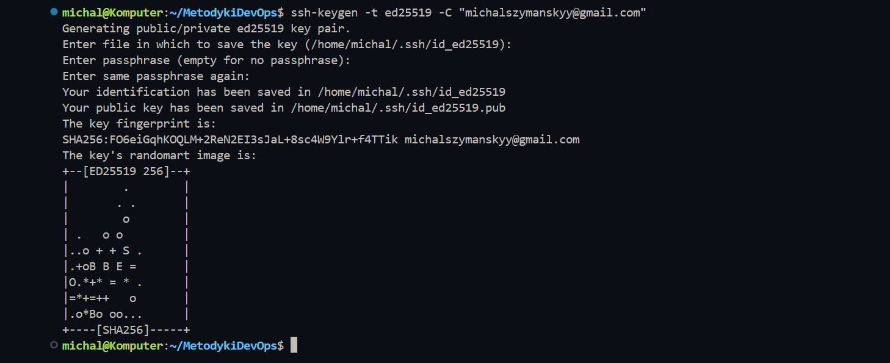
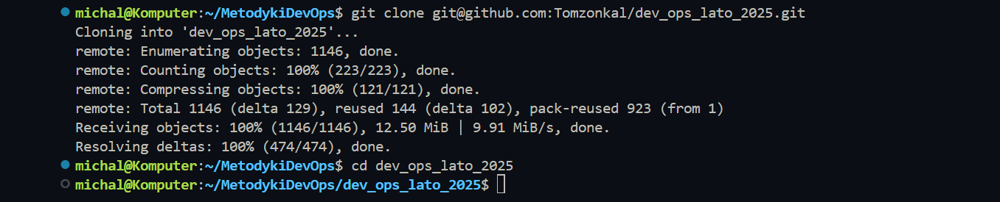
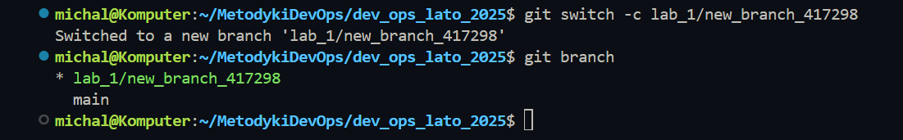
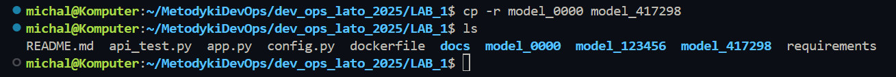
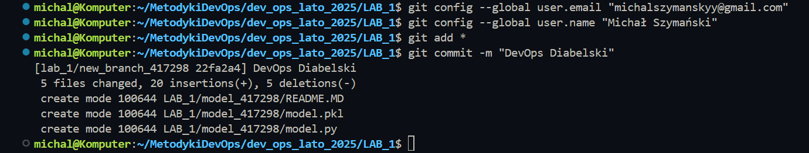
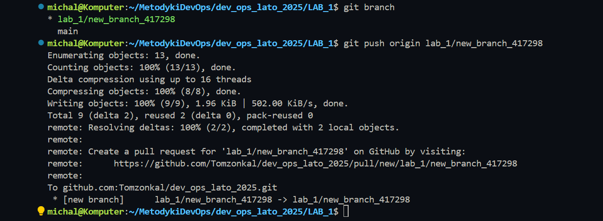
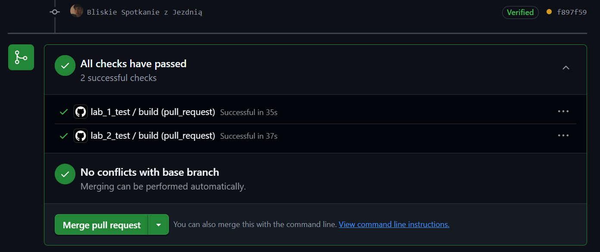

# Laboratorium Git & GitHub

## Cel Laboratorium
Celem laboratorium było zapoznanie się z podstawowymi komendami Git oraz procesem pracy z GitHub, w tym tworzeniem gałęzi, commitów, pushowaniem zmian oraz tworzeniem pull requestów.

## Wykonane Kroki

### 1. Konfiguracja Klucza SSH

#### 1.1 Generowanie Klucza SSH



```bash
ssh-keygen -t ed25519 -C "michalszymanskyy@gmail.com"
```
Klucz został zapisany w domyślnej lokalizacji `/home/michal/.ssh/id_ed25519`.

#### 1.2 Dodanie Klucza do GitHub
Klucz publiczny został dodany do GitHub w sekcji **Settings > SSH and GPG keys**.

---

### 2. Pobranie Repozytorium

#### 2.1 Klonowanie Repozytorium
```bash
git clone git@github.com:Tomzonkal/dev_ops_lato_2025.git
cd dev_ops_lato_2025
```


---

### 3. Stworzenie Gałęzi Roboczej

#### 3.1 Tworzenie Nowej Gałęzi
```bash
git switch -c lab_1/new_branch_417298
git branch
```


---

### 4. Edycja Kodu

#### 4.1 Kopiowanie i Zmiana Nazwy Folderu
```bash
cp -r Lab_1/model_0000 Lab_1/model_417298
```


#### 4.2 Edycja Pliku `config.py`
```python
id_list=[
    "0000",
    "123456",
    "417298"
]
```

#### 4.3 Zmiana Nazwy Funkcji w `model_417298`
W `model.py` zmieniono `run_model_0000` na `run_model_417298`.

#### 4.4 Importowanie Nowego Modelu w `app.py`
```python
from model_417298 import model as model_417298
```

#### 4.5 Dodanie Nowej Ścieżki API
```python
@app.route('/api/model_417298')
def model_417298_input():
    result = model_417298.run_model_417298(input=input)
    return result
```

---

### 5. Dodanie Zmian do Repozytorium

#### 5.1 Konfiguracja Użytkownika Git
```bash
git config --global user.email "michalszymanskyy@gmail.com"
git config --global user.name "Michał Szymański"
```

#### 5.2 Dodanie i Commitowanie Zmian
```bash
git add *
git commit -m "DevOps Diabelski"
```

#### 5.3 Wypychanie Zmian
```bash
git push --set-upstream origin lab_1/new_branch_417298
```
Wystąpił błąd uprawnień, więc zmiany przesłano ręcznie na GitHub.





---

### 6. Tworzenie Pull Requesta

#### 6.1 Weryfikacja Zmian na GitHub
Zmiany zostały zweryfikowane na GitHub.

#### 6.2 Tworzenie Pull Requesta
Pull request został utworzony, łącząc gałąź `lab_1/new_branch_417298` z `TEST`.

#### 6.3 Wynik Testów
Testy automatyczne przeszły pomyślnie.



---

### 7. Sprawozdanie

#### 7.1 Dokumentacja Pracy
Sprawozdanie zapisano w formacie Markdown w folderze `Lab_1`.

#### 7.2 Oddanie Pracy
Sprawozdanie zostało dodane do gałęzi `lab_1/new_branch_417298` i dołączone do pull requesta.

---

## Tematy Dodatkowe

### 🔹 Różnica między `git fetch` a `git pull`
- `git fetch`: Pobiera zmiany z repozytorium zdalnego, ale nie scala ich automatycznie.
- `git pull`: Pobiera zmiany i scala je automatycznie z lokalnym repozytorium.

### 🔹 Local vs Remote Repository
- **Local Repository** – Repozytorium na komputerze użytkownika.
- **Remote Repository** – Repozytorium na serwerze (np. GitHub).

### 🔹 Gitflow vs GitHub Flow
- **Gitflow**: Rozgałęzianie z wieloma gałęziami (main, develop, feature, release, hotfix).
- **GitHub Flow**: Prostsza strategia z jedną główną gałęzią i pull requestami.

### 🔹 Czemu używa się Release Branchy?
- Stabilizacja kodu przed wydaniem.
- Oddzielenie nowej funkcjonalności od stabilnej wersji.
- Lepsze zarządzanie wersjami i rollbackiem.

---

## Podsumowanie
Laboratorium zostało wykonane zgodnie z instrukcją. Klucz SSH został skonfigurowany, repozytorium sklonowane, utworzono gałąź roboczą, edytowano kod, a zmiany zostały zatwierdzone i przesłane w formie pull requesta. Testy automatyczne przeszły pomyślnie. Dodatkowe tematy pogłębiły wiedzę na temat Git i GitHub.
