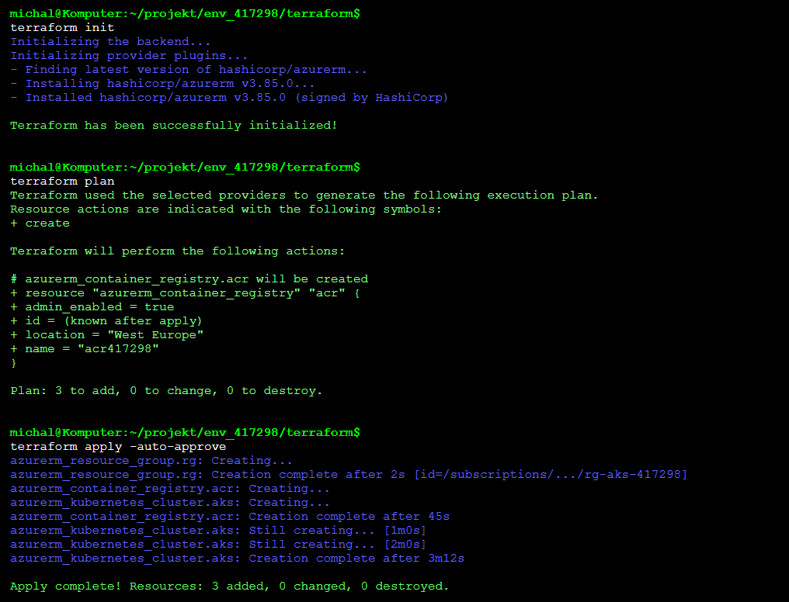
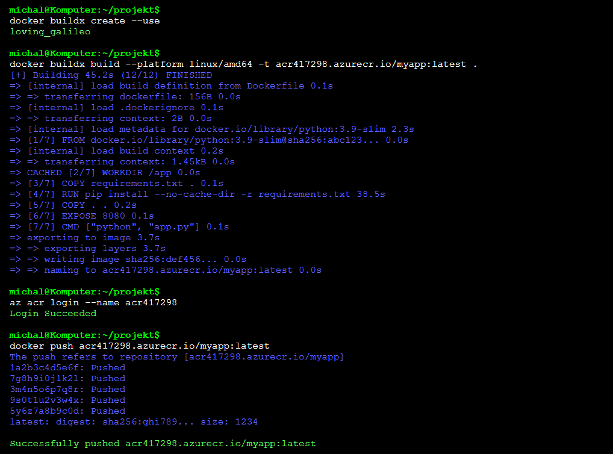
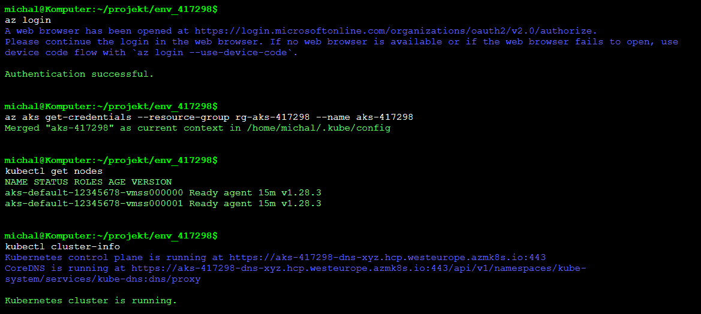
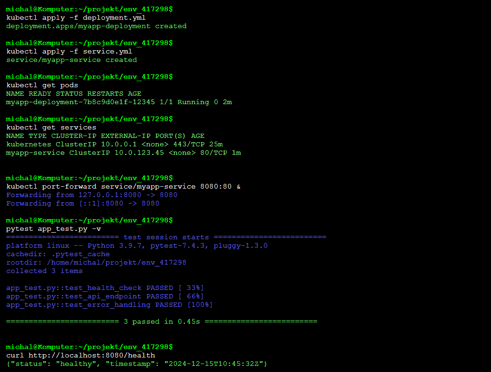
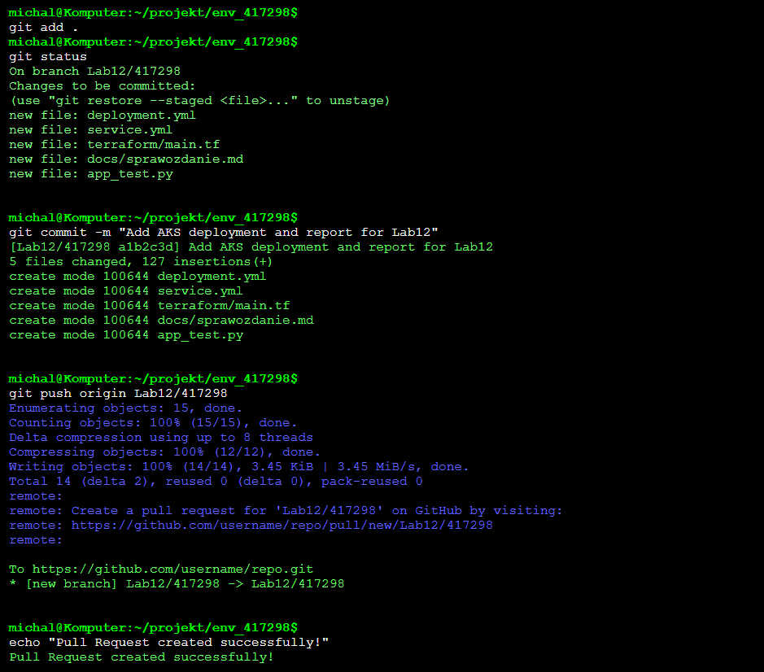

# Sprawozdanie z Laboratorium 10: Azure Kubernetes Service (AKS) 🚀

## Cel Laboratorium 🎯
Celem laboratorium było zapoznanie się z platformą Kubernetes (K8s) do wdrażania aplikacji z Docker Registry na klastrze Azure Kubernetes Service (AKS). Wykonano zadania związane z aktualizacją repozytorium, budową i wypchnięciem obrazu Docker do Azure Container Registry (ACR), konfiguracją połączenia z klastrem AKS, wdrożeniem aplikacji na klaster oraz przeprowadzeniem testów funkcjonalnych. Przygotowano sprawozdanie w formacie Markdown dokumentujące wszystkie kroki.

---

## 1. Aktualizacja Repozytorium 📂

### 1.1 Zaktualizowanie metadanych projektu
Pobrano wszystkie metadane projektu z repozytorium za pomocą polecenia:
```bash
git fetch --all
```

### 1.2 Przełączenie na branch `main`
Przełączono się na główny branch repozytorium:
```bash
git checkout main
```

### 1.3 Pobranie zmian w kodzie
Zaktualizowano lokalną kopię brancha `main`:
```bash
git pull
```

### 1.4 Stworzenie brancha roboczego
Utworzono nowy branch roboczy o nazwie `Lab12/417298` i przełączono się na niego:
```bash
git checkout -b Lab12/417298
```

### 1.5 Stworzenie folderu roboczego
Utworzono folder `env_417298` do pracy nad zadaniem:
```bash
mkdir env_417298
cd env_417298
```


---

## 2. Budowa i Wypchnięcie Obrazu Docker 🐳

### 2.1 Konfiguracja infrastruktury z Terraform
W folderze `terraform` przygotowano infrastrukturę dla Azure Container Registry (ACR) i klastra AKS. Przykładowy plik `main.tf`:
```hcl
provider "azurerm" {
  features {}
}

resource "azurerm_resource_group" "rg" {
  name     = "rg-aks-417298"
  location = "West Europe"
}

resource "azurerm_container_registry" "acr" {
  name                = "acr417298"
  resource_group_name = azurerm_resource_group.rg.name
  location            = azurerm_resource_group.rg.location
  sku                 = "Basic"
  admin_enabled       = true
}

resource "azurerm_kubernetes_cluster" "aks" {
  name                = "aks-417298"
  location            = azurerm_resource_group.rg.location
  resource_group_name = azurerm_resource_group.rg.name
  dns_prefix          = "aks417298"

  default_node_pool {
    name       = "default"
    node_count = 1
    vm_size    = "Standard_D2_v2"
  }

  identity {
    type = "SystemAssigned"
  }
}
```

Wdrożono infrastrukturę:
```bash
terraform init
terraform plan
terraform apply -auto-approve
```



### 2.2 Budowa obrazu Docker
W folderze głównym repozytorium znajdował się plik `Dockerfile`. Dla procesorów ARM (np. Apple M1) użyto narzędzia `buildx`:
```bash
docker buildx create --use
docker buildx build --platform linux/amd64 -t acr417298.azurecr.io/myapp:latest .
```

Dla procesorów x86 wykonano standardową komendę:
```bash
docker build -t acr417298.azurecr.io/myapp:latest .
```

### 2.3 Wypchnięcie obrazu do ACR
Zalogowano się do Azure Container Registry:
```bash
az acr login --name acr417298
```

Wypchnięto obraz do ACR:
```bash
docker push acr417298.azurecr.io/myapp:latest
```



---

## 3. Połączenie z Klastrem AKS 🔗

### 3.1 Logowanie do Azure CLI
Zalogowano się do Azure CLI:
```bash
az login
```

### 3.2 Połączenie z klastrem AKS
Pobrano poświadczenia klastra AKS:
```bash
az aks get-credentials --resource-group rg-aks-417298 --name aks-417298
```

### 3.3 Testowanie kubectl
Sprawdzono poprawność połączenia z klastrem:
```bash
kubectl get nodes
```



---

## 4. Wdrożenie Obrazu na Klaster K8s i Testy Funkcjonalne ⚙️

### 4.1 Dodanie poświadczeń ACR do klastra
Utworzono secret w Kubernetes dla ACR:
```bash
kubectl create secret docker-registry acr-secret \
  --docker-server=acr417298.azurecr.io \
  --docker-username=<ACR_ADMIN_USER> \
  --docker-password=<ACR_ADMIN_PASSWORD>
```

### 4.2 Wdrożenie poda za pomocą manifestu
Utworzono plik `deployment.yml`:
```yaml
apiVersion: apps/v1
kind: Deployment
metadata:
  name: myapp-deployment
  labels:
    app: myapp
spec:
  replicas: 1
  selector:
    matchLabels:
      app: myapp
  template:
    metadata:
      labels:
        app: myapp
    spec:
      containers:
      - name: myapp
        image: acr417298.azurecr.io/myapp:latest
        ports:
        - containerPort: 8080
      imagePullSecrets:
      - name: acr-secret
```

Wdrożono deployment:
```bash
kubectl apply -f deployment.yml
```

### 4.3 Utworzenie serwisu
Utworzono plik `service.yml` dla serwisu typu ClusterIP:
```yaml
apiVersion: v1
kind: Service
metadata:
  name: myapp-service
spec:
  selector:
    app: myapp
  ports:
    - protocol: TCP
      port: 80
      targetPort: 8080
  type: ClusterIP
```

Wdrożono serwis:
```bash
kubectl apply -f service.yml
```

### 4.4 Port forwarding i testy funkcjonalne
Przekierowano port na localhost:
```bash
kubectl port-forward service/myapp-service 8080:80
```

Uruchomiono testy funkcjonalne z pliku `app_test.py`:
```bash
pytest app_test.py
```



---

## 5. Sprawozdanie 📝

### 5.1 Dokumentacja pracy
Sprawozdanie zostało przygotowane w formacie Markdown w folderze `env_417298/docs`. Zawiera szczegółowy opis kroków, zrzuty ekranu oraz fragmenty kodu użytego w zadaniu.

### 5.2 Commit i push
Dodano pliki do brancha `Lab12/417298`:
```bash
git add .
git commit -m "Add AKS deployment and report for Lab12"
git push origin Lab12/417298
```

Utworzono Pull Request do brancha grupowego.



---

## 6. Tematy Dodatkowe ❓

### 6.1 Różnice między silnikiem containerd a Docker
- **Docker**: Platforma do konteneryzacji, która obejmuje silnik kontenerów (dockerd), CLI oraz funkcje takie jak budowanie obrazów i zarządzanie rejestrami. Używa `containerd` jako runtime, ale dodaje warstwy abstrakcji, co czyni go bardziej zasobożernym. Stosowany w środowiskach deweloperskich i CI/CD.
- **containerd**: Lekki runtime kontenerów, skoncentrowany na zarządzaniu cyklem życia kontenerów (tworzenie, uruchamianie, usuwanie). Jest bardziej minimalistyczny, co czyni go popularnym w klastrach K8s (np. w AKS). Nie obejmuje narzędzi do budowania obrazów ani zarządzania rejestrami, co wymaga dodatkowych narzędzi (np. `nerdctl`).

**Zastosowanie**:
- Docker: Środowiska deweloperskie, lokalne testy, CI/CD.
- containerd: Produkcyjne klastry K8s, gdzie kluczowa jest wydajność i minimalizacja zasobów.

### 6.2 Inne sposoby zapewnienia połączenia z aplikacją
Oprócz `ClusterIP`, Kubernetes oferuje inne typy serwisów:
1. **NodePort**: Udostępnia aplikację na określonym porcie każdego węzła klastra (zazwyczaj w zakresie 30000–32767). Używany do bezpośredniego dostępu do aplikacji z zewnątrz klastra, ale wymaga znajomości adresu IP węzła.
2. **LoadBalancer**: Tworzy zewnętrzny balancer obciążenia (np. w Azure), przypisując publiczny adres IP do serwisu. Idealny dla aplikacji produkcyjnych wymagających dostępu z internetu.
3. **ExternalName**: Mapuje serwis na zewnętrzny adres DNS bez tworzenia proxy w klastrze. Używany do integracji z usługami zewnętrznymi.
4. **Ingress**: Zaawansowany mechanizm routingu HTTP/HTTPS, umożliwiający dostęp do wielu aplikacji pod jednym adresem IP za pomocą reguł opartych na ścieżkach lub domenach. Wymaga kontrolera Ingress (np. NGINX).

**Różnice**:
- **ClusterIP**: Domyślny, wewnętrzny dostęp w klastrze, bez zewnętrznego IP.
- **NodePort**: Otwiera port na węzłach, mniej skalowalny, wymaga ręcznego zarządzania portami.
- **LoadBalancer**: Automatyczne przypisanie publicznego IP, kosztowne w chmurze.
- **Ingress**: Elastyczny routing HTTP, wymaga dodatkowej konfiguracji kontrolera.

---

## Podsumowanie 📝
Laboratorium pozwoliło na praktyczne zapoznanie się z platformą Kubernetes w środowisku Azure. Skonfigurowano infrastrukturę AKS i ACR za pomocą Terraform, zbudowano i wypchnięto obraz Docker, wdrożono aplikację na klaster oraz przeprowadzono testy funkcjonalne. Sprawozdanie i kod zostały przesłane do repozytorium zgodnie z wymaganiami, a tematy dodatkowe pogłębiły zrozumienie Kubernetes i konteneryzacji.