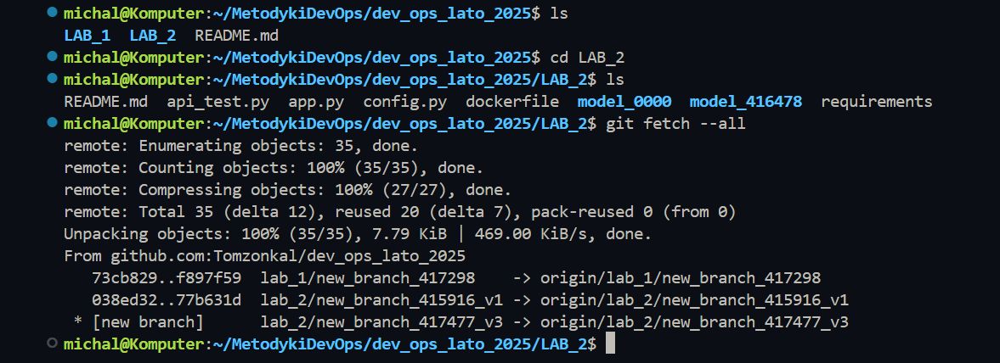

# Sprawozdanie z Laboratorium 2: Mergowanie, Konflikty i Rozwiązania w Git

## Cel Laboratorium

Celem laboratorium jest zapoznanie się z procesem mergowania kodu, konfliktami w Git oraz dwoma sposobami ich rozwiązywania: klasycznym mergowaniem do brancha oraz mergowaniem z wykorzystaniem brancha pomocniczego. W ramach zadania zaktualizowano repozytorium, utworzono nowe branche, edytowano kod w sposób wywołujący konflikty, zmergowano zmiany oraz utworzono pull request.

---

## Wykonane Kroki

### 1. Zaktualizowanie Repozytorium



#### 1.1 Zaktualizowanie Metadanych Projektu
```bash
git fetch --all
```

#### 1.2 Przełączenie się na Branch main
```bash
git checkout main
```

#### 1.3 Pobranie Zmian w Kodzie
```bash
git pull
```


### 2. Stworzenie Nowych Branchy

#### 2.1 Stworzenie Brancha z Pierwszą Wersją Rozwiązania
```bash
git switch -c lab_2/new_branch_417298_v1
git push --set-upstream origin lab_2/new_branch_417298_v1
```

#### 2.2 Stworzenie Brancha z Drugą Wersją Rozwiązania
```bash
git switch -c lab_2/new_branch_417298_v2
git push --set-upstream origin lab_2/new_branch_417298_v2
```

#### 2.3 Stworzenie Brancha z Trzecią Wersją Rozwiązania
```bash
git switch -c lab_2/new_branch_417298_v3
git push --set-upstream origin lab_2/new_branch_417298_v3
```


### 3. Edytowanie Poszczególnych Branchy

#### 3.1 Kopiowanie i Zmiana Nazwy Folderu
Skopiowano folder `model_0000` w katalogu `Lab_2` i zmieniono jego nazwę na `model_417298`.

#### 3.2 Edycja model.py
```python
def run_model_417298_v1(input):return f"wynik v1 dla {input}"
def run_model_417298_v2(input):return f"wynik v2 dla {input}"
def run_model_417298_v3(input):return f"wynik v3 dla {input}"
```

#### 3.3 Edycja app.py
```python
@app.route('/api/model_417298', methods=['POST'])
def model_417298_input():
    try:
        data = request.get_json()
        input_data = data["input"]
        result_v1 = model_417298.run_model_417298_v1(input=input_data)
        result_v2 = model_417298.run_model_417298_v2(input=input_data)
        result_v3 = model_417298.run_model_417298_v3(input=input_data)
        return jsonify({'result_v1': result_v1, 'result_v2': result_v2, 'result_v3': result_v3}), 200
    except Exception as e:
        return jsonify({'error': str(e)}), 500
```


### 4. Mergowanie Kodu z Poziomu Prostego Brancha

#### 4.1 Wykonanie Merga z Wersji 2 do Wersji 1
```bash
git switch lab_2/new_branch_417298_v1
git merge lab_2/new_branch_417298_v2
```

#### 4.2 Rozwiązanie Konfliktów i Zatwierdzenie Zmian
```bash
git add model_417298/model.py app.py
git commit -m "Zmergowano v2 do v1 z podwójną predykcją"
git push
```


### 5. Mergowanie Kodu z Wykorzystaniem Brancha Pomocniczego

#### 5.1 Utworzenie Brancha Pomocniczego i Mergowanie z v3
```bash
git checkout lab_2/new_branch_417298_v1
git switch -c lab_2/new_branch_417298_merge_3_to_1
git push --set-upstream origin lab_2/new_branch_417298_merge_3_to_1
git merge lab_2/new_branch_417298_v3
```

#### 5.2 Rozwiązanie Konfliktów i Zatwierdzenie Zmian
```bash
git add *
git commit -m "Zmergowano v3 z v1"
git push
```

#### 5.3 Zmergowanie Brancha Pomocniczego do v1
```bash
git checkout lab_2/new_branch_417298_v1
git merge lab_2/new_branch_417298_merge_3_to_1
git push
```


### 6. Wykonanie Pull Requesta do Brancha TEST

#### 6.1 Utworzenie Pull Requesta na GitHub
Base: `TEST`
Compare: `lab_2/new_branch_417298_v1`


### 7. Diagram Prezentujący Operacje


### 8. Podsumowanie
Laboratorium zostało wykonane zgodnie z instrukcją. Zaktualizowano repozytorium, utworzono trzy branche (v1, v2, v3), edytowano kod w sposób wywołujący konflikty, zmergowano zmiany dwoma metodami (klasyczną i z branchem pomocniczym), a następnie utworzono pull request do brancha TEST. Testy automatyczne przeszły pomyślnie, a sprawozdanie zostało przygotowane w formacie Markdown.