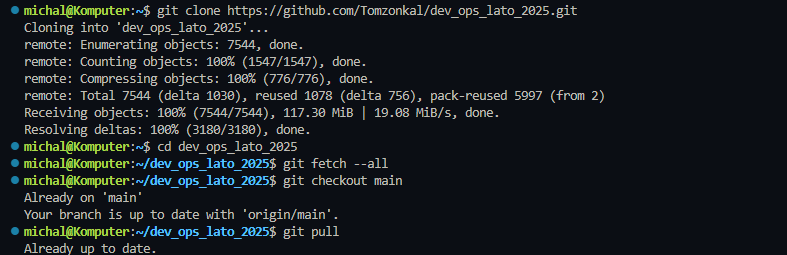
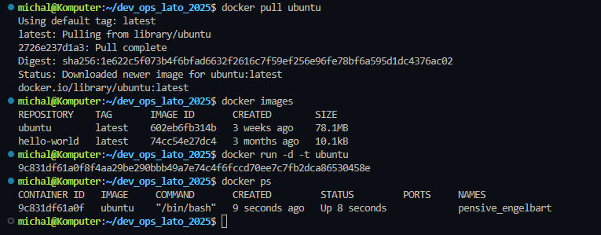
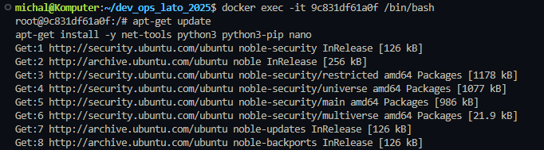
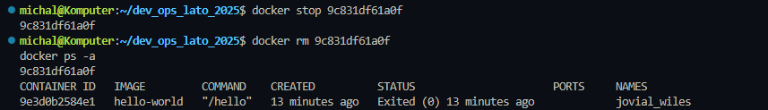
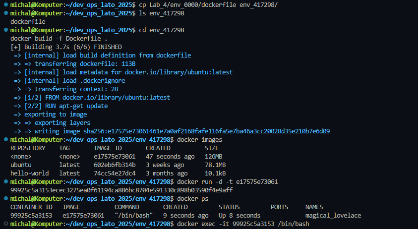
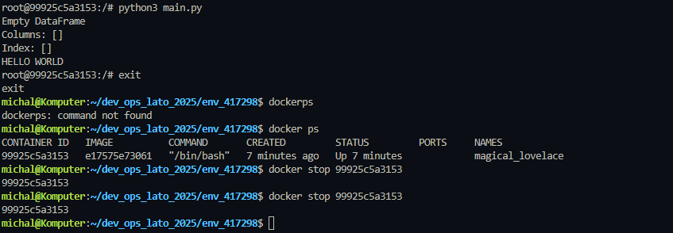

# Sprawozdanie z Laboratorium 4: Docker jako Środowisko Robocze

## 📋 Cel Laboratorium

Celem laboratorium jest poznanie narzędzia **Docker** jako sposobu na tworzenie i automatyzację wirtualnych środowisk roboczych. W ramach zadania wykonano ręczną oraz automatyczną konfigurację środowiska w kontenerze Docker, a także przetestowano działanie skryptu Python.

---

## 🛠️ Krok 1: Aktualizacja Repozytorium

### 1.1 Zaktualizowanie metadanych projektu

Wykonano komendę:

```bash
git fetch --all
```

**Wynik:**  
Metadane projektu zostały pobrane.  

---

### 1.2 Przełączenie na branch `main`

Użyto komendy:

```bash
git checkout main
```

**Wynik:**  
Poprawnie przełączono się na gałąź `main`.

---

### 1.3 Pobranie zmian w kodzie

Wykonano komendę:

```bash
git pull
```

**Wynik:**  
Najnowsze zmiany zostały pobrane z repozytorium.  



---

## 🐳 Krok 2: Tworzenie Kontenera za Pomocą Terminala

### 2.1 Pobranie obrazu Ubuntu

Użyto komendy:

```bash
docker pull ubuntu
```

**Wynik:**  
Obraz Ubuntu został pobrany z publicznego repozytorium.  



---

### 2.2 Weryfikacja pobranego obrazu

Wykonano komendę:

```bash
docker images
```

**Wynik:**  
Lista pobranych obrazów zawiera obraz `ubuntu`.

---

### 2.3 Uruchomienie kontenera

Utworzono kontener na bazie obrazu Ubuntu:

```bash
docker run -d -t ubuntu
```

**Wynik:**  
Kontener został uruchomiony w trybie odłączonym z włączonym terminalem.

---

### 2.4 Weryfikacja działających kontenerów

Użyto komendy:

```bash
docker ps
```

**Wynik:**  
Kontener jest widoczny na liście działających kontenerów.  


---

### 2.5 Podłączenie do kontenera

Podłączono się do kontenera:

```bash
docker exec -it 9c831df61a0f /bin/bash
```

**Wynik:**  
Uzyskano dostęp do terminala wewnątrz kontenera.

---

## 🔧 Krok 3: Ręczna Konfiguracja Kontenera

### 3.1 Instalacja brakujących pakietów

Wykonano komendy w kontenerze:

```bash
apt-get update
apt-get install -y net-tools python3 python3-pip nano
```

**Wynik:**  
Pakiety zostały zainstalowane.  



---

### 3.2 Stworzenie pliku `main.py`

Utworzono plik `main.py` za pomocą edytora `nano` i skopiowano kod z pliku `main.py` z folderu `Lab_4`.

---

### 3.3 Uruchomienie pliku `main.py`

Wykonano:

```bash
python3 main.py
```

**Wynik:**  
Pojawił się błąd związany z brakiem biblioteki `pandas`.

---

### 3.4 Instalacja biblioteki `pandas`

Zainstalowano bibliotekę:

```bash
pip install pandas
```

**Wynik:**  
Biblioteka `pandas` została poprawnie zainstalowana.

---

### 3.5 Ponowne uruchomienie `main.py`

Ponownie uruchomiono skrypt:

```bash
python3 main.py
```

**Wynik:**  
Skrypt wykonał się bez błędów.

---

### 3.6 Wyjście z kontenera

Wyjście z terminala kontenera:

```bash
exit
```

---

### 3.7 Zatrzymanie kontenera

Zatrzymano kontener:

```bash
docker stop 9c831df61a0f
```

**Wynik:**  
Kontener został zatrzymany.  



---

### 3.8 Usunięcie kontenera

Usunięto kontener i zweryfikowano:

```bash
docker rm 9c831df61a0f
docker ps -a
```

**Wynik:**  
Kontener został usunięty.

---

## ⚙️ Krok 4: Automatyzacja Konfigurowania Środowiska

### 4.1 Stworzenie folderu

Utworzono folder `env_2825` dla mojego numeru indeksu.

---

### 4.2 Skopiowanie i uzupełnienie pliku `Dockerfile`

Skopiowano plik `Dockerfile` z folderu `env_0000` i dodano komendy:
- `apt-get update`
- `apt-get install -y net-tools python3 python3-pip nano`
- `pip install pandas`

---

### 4.3 Budowanie obrazu

Wykonano komendę:

```bash
docker build -f path_to_dockerfile .
```

**Wynik:**  
Obraz został zbudowany.



---

### 4.4 Uruchomienie kontenera

Uruchomiono kontener na bazie nowego obrazu, podobnie jak w kroku 2.3.

---

### 4.5 Weryfikacja i podłączenie

Zweryfikowano działanie kontenera za pomocą `docker ps` i podłączono się do niego.

---

### 4.6 Testowanie `main.py`

Utworzono plik `main.py` w nowym kontenerze i uruchomiono go. Skrypt działał bez błędów dzięki automatycznej instalacji bibliotek.


**Wynik:**  
Kod został uruchomiony.



---

## 📚 Tematy Dodatkowe

### Co oznaczają flagi `-t` i `-d` w komendzie `docker run`?

- **`-t` (tty):** Alokuje pseudo-terminal dla kontenera, umożliwiając interaktywną pracę w terminalu.
- **`-d` (detached):** Uruchamia kontener w tle, nie blokując terminala użytkownika.  
Flagi te zostały użyte, aby kontener działał w tle, a jednocześnie umożliwiał dostęp do terminala.

---

### Różnica między `RUN` a `CMD` w `Dockerfile`

- **`RUN`:** Wykonuje komendę podczas budowania obrazu, zapisując wynik w warstwie obrazu (np. instalacja pakietów).  
- **`CMD`:** Określa domyślną komendę uruchamianą po starcie kontenera (np. uruchomienie aplikacji).  

**Inne popularne komendy:**  
- `COPY` – kopiuje pliki z hosta do obrazu.  
- `WORKDIR` – ustawia katalog roboczy.

---

### Kopiowanie plików między komputerem a kontenerem

- **Z komputera do kontenera:**  
  ```bash
  docker cp lokalny_plik <ID_KONTENERA>:/ścieżka_w_kontenerze
  ```
- **Z kontenera na komputer:**  
  ```bash
  docker cp <ID_KONTENERA>:/ścieżka_w_kontenerze lokalny_plik
  ```

---

## ✅ Podsumowanie

Laboratorium pozwoliło na praktyczne zapoznanie się z Dockerem jako narzędziem do automatyzacji środowisk roboczych. Wykonano ręczną konfigurację kontenera oraz automatyczną za pomocą pliku `Dockerfile`. Skrypt `main.py` uruchomiono poprawnie w obu przypadkach, a proces został udokumentowany zrzutami ekranu i opisami.