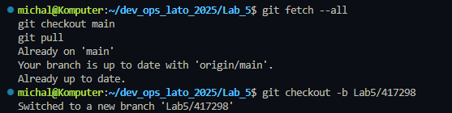
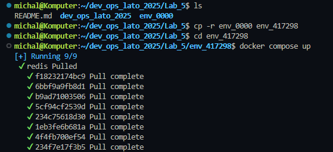
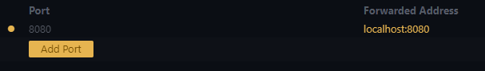
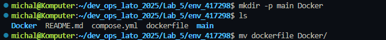
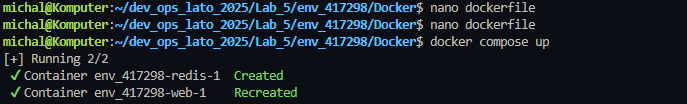

# 📋 Sprawozdanie z Laboratorium 5 - Docker Compose

## 🎯 Cel Laboratorium
Celem laboratorium było zapoznanie się z narzędziem Docker Compose oraz jego wykorzystanie do zarządzania aplikacjami konteneryzowanymi. Poniżej opisano wykonane kroki wraz ze zdjęciami i wyjaśnieniami.

---

## ✅ Wykonane Kroki

### 1️⃣ Zaktualizowanie Repozytorium
- **1.1 Zaktualizowanie wszystkich metadanych projektu**  
  Wykonano komendę `git fetch --all`.  

- **1.2 Przełączenie na branch main**  
  Wykonano komendę `git checkout main`.  


- **1.3 Pobranie zmian w kodzie**  
  Wykonano komendę `git pull`.  


- **1.4 Stworzenie i przełączenie na branch roboczy**  
  Stworzono branch `Lab5/417298` i przełączono się na niego za pomocą `git checkout -b Lab5/417298`.  

  

---

### 2️⃣ Stworzenie Folderu Roboczego
- **2.1 Skopiowanie zawartości do folderu `env_417298`**  
  Skopiowano zawartość folderu `env_00000` do nowo utworzonego folderu `env_417298`.  

  

---

### 3️⃣ Uruchomienie Docker Compose
- **3.1 Uruchomienie aplikacji**  
  Wykonano komendę `docker compose up` w katalogu projektu.  

- **3.2 Sprawdzenie aplikacji**  
  Aplikacja była dostępna pod adresem `http://localhost:8000/`. Po odświeżeniu strony działał licznik.  

  

- **3.3 Wyświetlenie kontenerów**  
  W oddzielnym terminalu sprawdzono uruchomione kontenery.  

---

### 4️⃣ Docker Compose ze Strażnikiem
- **4.1 Modyfikacja pliku `compose.yml`**  
  Dodano sekcję `develop` z opcją `watch` do synchronizacji kodu:  
  ```yaml
  services:
    web:
      build: .
      ports:
        - "8000:5000"
      develop:
        watch:
          - action: sync
            path: .
            target: /code
    redis:
      image: "redis:alpine"
  ```
  

- **4.2 Uruchomienie z `docker compose watch`**  
  Wykonano komendę `docker compose watch`.  

  

- **4.3 Zmiana tekstu w `app.py`**  
  Zmodyfikowano tekst w pliku `app.py` i zaobserwowano automatyczną aktualizację po odświeżeniu strony.  

  

- **4.4 Wyjaśnienie zmian**  
  Tekst zmienił się po odświeżeniu, ponieważ `watch` synchronizuje zmiany w kodzie. Licznik się nie zresetował, gdyż jego stan jest utrzymywany przez Redis.

---

### 5️⃣ Zmiana Portu
- **5.1 Edycja portu w `compose.yml`**  
  Zmodyfikowano port na `8080:5000`. Aplikacja jest teraz dostępna pod `http://localhost:8080/`.  

  

---

### 6️⃣ Separacja Kodu od Deploymentu
- **6.1 Stworzenie struktury katalogów**  
  Utworzono strukturę:  
  ```
  ├── env_417298
      |── main
      |    |── requirements.txt
      |    └── app.py
      |── Docker
      |    └── Dockerfile
      └── compose.yml
  ```
  

- **6.2 Modyfikacja plików**  
  Zaktualizowano `Dockerfile` i `compose.yml`, aby działały z nowej lokalizacji.  

    

  

- **6.3 Uruchomienie**  
  Wykonano `docker compose up` z folderu `env_417298`, co uruchomiło aplikację.  
  
  