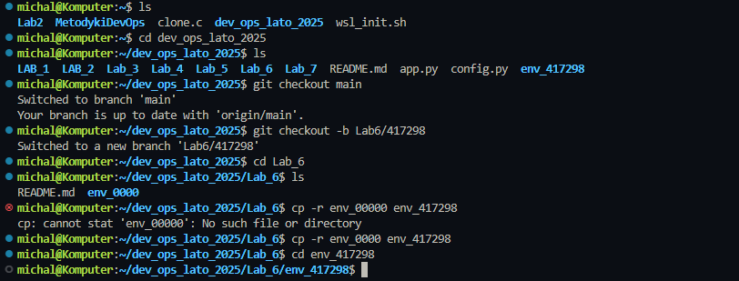
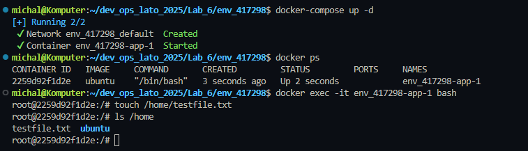
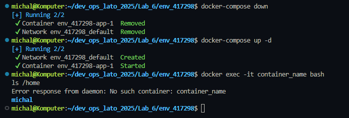
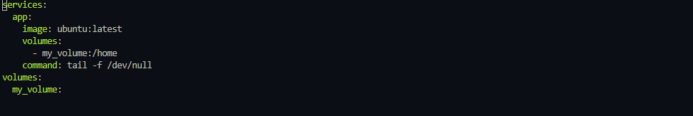
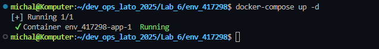
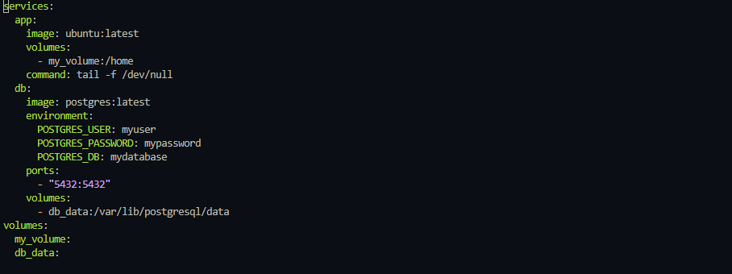
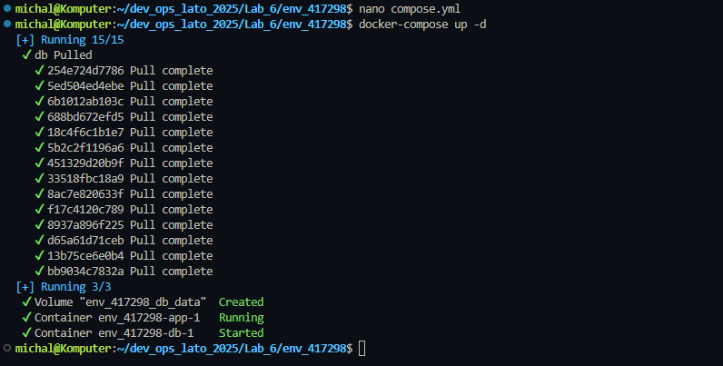

# Sprawozdanie z Laboratorium 6: Docker - Volumny i Sieci 🐳

## Cel Laboratorium 🎯
Celem laboratorium było zapoznanie się z narzędziem Docker Compose, w szczególności z zarządzaniem volumnami, sieciami oraz eksportem portów. W trakcie ćwiczeń wykonano zadania związane z aktualizacją repozytorium, konfiguracją Docker Compose, zarządzaniem danymi w kontenerach oraz konfiguracją bazy danych PostgreSQL.

---

## 1. Aktualizacja Repozytorium 📂

### 1.1 Zaktualizowanie metadanych projektu
Wykonano polecenie `git fetch --all`, aby pobrać wszystkie metadane projektu.

### 1.2 Przełączenie na branch `main`
Przełączono się na branch `main` za pomocą polecenia:
```bash
git checkout main
```

### 1.3 Pobranie zmian w kodzie
Pobrano najnowsze zmiany z brancha `main`:
```bash
git pull
```

### 1.4 Stworzenie brancha roboczego
Stworzono nowy branch roboczy o nazwie `Lab6/417298` i przełączono się na niego:
```bash
git checkout -b Lab6/417298
```



---

## 2. Stworzenie Folderu na Podstawie `env_00000` 📁

### 2.1 Skopiowanie zawartości
Skopiowano zawartość folderu `env_00000` do nowego folderu `env_417298`:
```bash
cp -r env_00000 env_417298
```

---

## 3. Uruchomienie Docker Compose bez Volumenu 🚀

### 3.1 Budowanie projektu
Przejrzano plik `docker-compose.yml` i uruchomiono projekt bez volumnów:
```bash
docker-compose up -d
```


### 3.2 Dodanie pliku w folderze `/home`
W kontenerze `env_417298-app-1` utworzono plik `testfile.txt` w folderze `/home`:
```bash
docker exec -it env_417298-app-1 bash
touch /home/testfile.txt
ls /home
```



### 3.3 Usunięcie i ponowne uruchomienie kontenera
Usunięto kontener, a następnie uruchomiono go ponownie:
```bash
docker-compose down
docker-compose up -d
```

Sprawdzono, czy plik `testfile.txt` nadal istnieje:
```bash
docker exec -it env_417298-app-1 bash
ls /home
```

Plik nie istniał, co potwierdza, że bez volumnu dane nie są trwałe.



---

## 4. Uruchomienie Docker Compose z Volumenem 💾

### 4.1 Edycja pliku `docker-compose.yml`
Dodano volumen do pliku `docker-compose.yml`, aby podpiąć folder `/home` do volumnu `my_volume`:

```yaml
services:
  app:
    image: ubuntu:latest
    volumes:
      - my_volume:/home
    command: tail -f /dev/null

volumes:
  my_volume:
```



### 4.2 Budowanie projektu
Ponownie uruchomiono projekt:
```bash
docker-compose up -d
```

### 4.3 Dodanie pliku w folderze `/home`
Ponownie utworzono plik `testfile.txt` w folderze `/home`:
```bash
docker exec -it env_417298-app-1 bash
touch /home/testfile.txt
ls /home
```

### 4.4 Usunięcie i ponowne uruchomienie kontenera
Usunięto kontener i uruchomiono go ponownie:
```bash
docker-compose down
docker-compose up -d
```

Sprawdzono, czy plik `testfile.txt` nadal istnieje:
```bash
docker exec -it env_417298-app-1 bash
ls /home
```

Tym razem plik istniał, co potwierdza, że dane zostały zachowane dzięki volumnowi.



---

## 5. Sieć Docker i Eksport Portów 🌐

### 5.1 Dodanie obrazu PostgreSQL
Zmodyfikowano plik `docker-compose.yml`, dodając serwis `db` z obrazem PostgreSQL:
```yaml
services:
  app:
    image: ubuntu:latest
    volumes:
      - my_volume:/home
    command: tail -f /dev/null

  db:
    image: postgres:latest
    environment:
      POSTGRES_USER: myuser
      POSTGRES_PASSWORD: mypassword
      POSTGRES_DB: mydatabase
    ports:
      - "5432:5432"
    volumes:
      - db_data:/var/lib/postgresql/data

volumes:
  my_volume:
  db_data:
```



### 5.2 Uruchomienie i eksport portu
Uruchomiono projekt, eksportując port 5432:
```bash
docker-compose up -d
```



### 5.3 Połączenie z bazą za pomocą DBeaver
Połączono się z bazą danych za pomocą DBeaver, używając danych:
- Host: `localhost`
- Port: `5432`
- Database: `mydatabase`
- User: `myuser`
- Password: `mypassword`

Utworzono prostą tabelę w bazie danych.

### 5.4 Dodanie drugiego kontenera PostgreSQL
Dodano kolejny serwis `db2` do `docker-compose.yml`:
```yaml
  db2:
    image: postgres:latest
    environment:
      POSTGRES_USER: myuser
      POSTGRES_PASSWORD: mypassword
      POSTGRES_DB: mydatabase2
```

### 5.5 Dodanie kontenerów do wspólnej sieci
Oba kontenery (`db` i `db2`) działały w domyślnej sieci `env_417298_default`.

### 5.6 Połączenie z bazą i wyświetlenie tabeli
Z kontenera `db2` połączono się z bazą `db` za pomocą lokalnego IP i wyświetlono utworzoną tabelę.

---

## Podsumowanie 📝
Laboratorium pozwoliło na praktyczne zapoznanie się z Docker Compose, w szczególności z zarządzaniem volumnami i sieciami. Wykonane zadania potwierdziły, że volumnów można używać do trwałego przechowywania danych, a konfiguracja sieci i eksport portów umożliwia komunikację między kontenerami oraz zewnętrznymi narzędziami, takimi jak DBeaver.