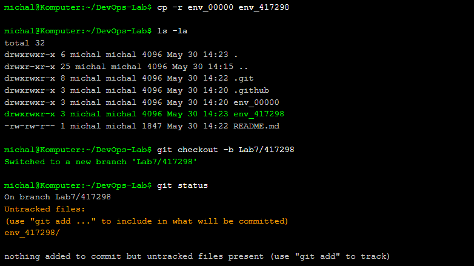
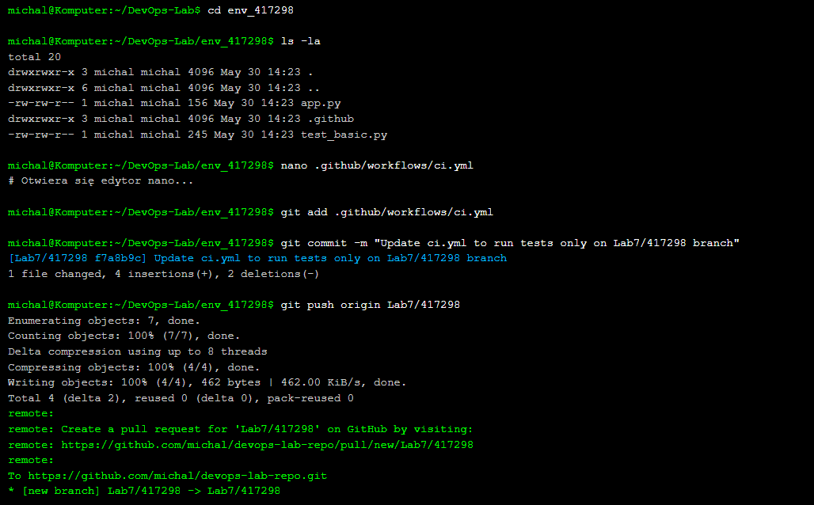
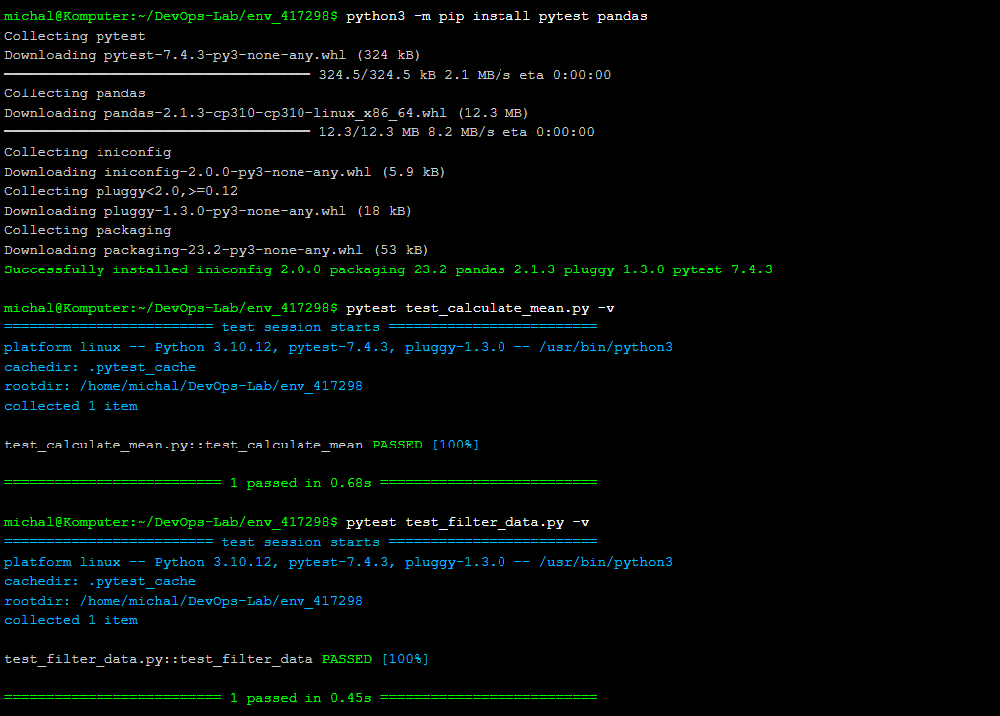
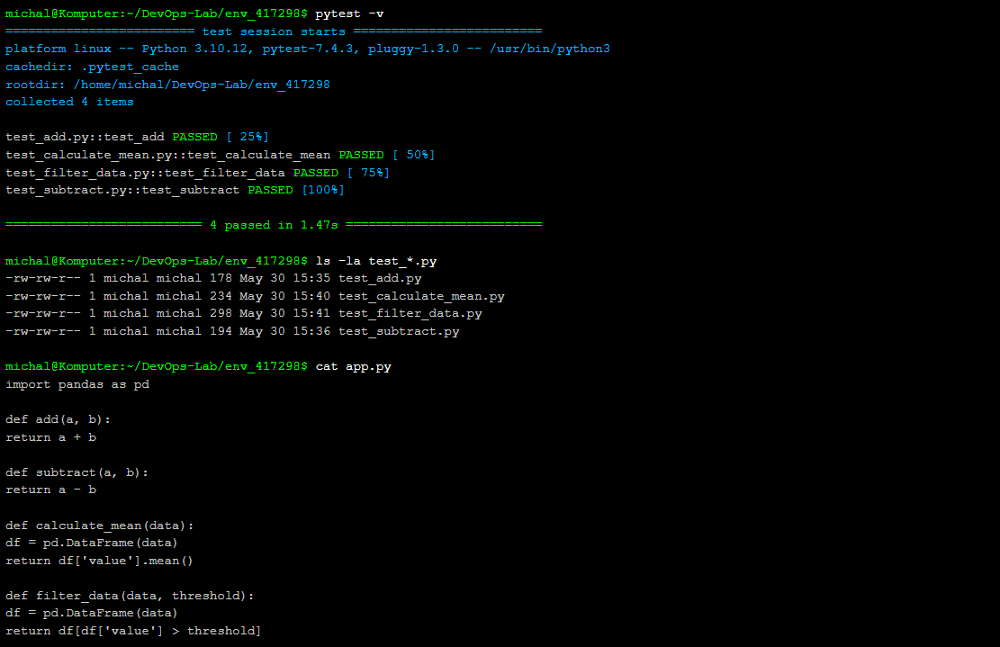
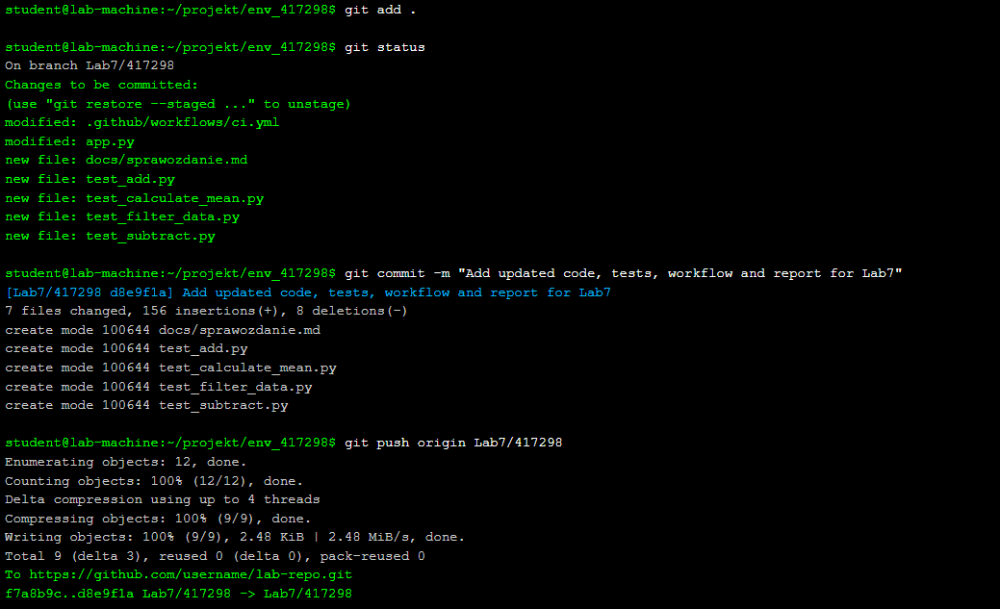

# Sprawozdanie z Laboratorium 7: GitHub Actions - Unit Testy i Automatyzacja 🛠️

## Cel Laboratorium 🎯
Celem laboratorium było zapoznanie się z narzędziem GitHub Actions oraz stworzenie własnego workflow do automatyzacji testów jednostkowych. W trakcie ćwiczeń zaktualizowano repozytorium, stworzono własne repo na podstawie szablonu, zmodyfikowano skrypt YAML, dodano nowe funkcje w Pythonie z testami, skonfigurowano równoległe joby w workflow oraz przygotowano sprawozdanie w formacie Markdown.

---

## 1. Aktualizacja Repozytorium 📂

### 1.1 Zaktualizowanie metadanych projektu
Wykonano polecenie `git fetch --all`, aby pobrać wszystkie metadane projektu:
```bash
git fetch --all
```

### 1.2 Przełączenie na branch `main`
Przełączono się na branch `main` za pomocą polecenia:
```bash
git checkout main
```

### 1.3 Pobranie zmian w kodzie
Pobrano najnowsze zmiany z brancha `main`:
```bash
git pull
```


---

## 2. Stworzenie Własnego Repozytorium 📁

### 2.1 Skopiowanie zawartości
Skopiowano zawartość folderu `env_00000` do nowego folderu o nazwie `env_417298`:
```bash
cp -r env_00000 env_417298
```

### 2.2 Stworzenie brancha roboczego
Na własnym repozytorium utworzono nowy branch roboczy o nazwie `Lab7/417298` i przełączono się na niego:
```bash
git checkout -b Lab7/417298
```



---

## 3. Edycja Skryptu YAML w Folderze `.github/workflows` ⚙️

### 3.1 Modyfikacja skryptu YAML
Zmodyfikowano plik YAML w folderze `.github/workflows` (np. `ci.yml`), aby testy uruchamiały się wyłącznie na branchu roboczym `Lab7/417298`. Dodano warunek w sekcji `on`:
```yaml
on:
  push:
    branches:
      - Lab7/417298
```



### 3.2 Commit i push zmian
Po upewnieniu się, że pracujemy na branchu `Lab7/417298`, wykonano commit i push zmian:
```bash
git add .github/workflows/ci.yml
git commit -m "Update ci.yml to run tests only on Lab7/417298 branch"
git push origin Lab7/417298
```

### 3.3 Weryfikacja testów
Sprawdzono w panelu GitHub Actions, czy testy uruchomiły się poprawnie na branchu `Lab7/417298`.



---

## 4. Modyfikacja Kodu Python i Testów 🐍

### 4.1 Dodanie nowych funkcji
W pliku Python (np. `app.py`) dodano dwie nowe funkcje wykorzystujące bibliotekę Pandas:
- `calculate_mean`: Oblicza średnią wartości w kolumnie DataFrame.
- `filter_data`: Filtruje dane w DataFrame na podstawie podanego warunku.

```python
import pandas as pd

def calculate_mean(data):
    df = pd.DataFrame(data)
    return df['value'].mean()

def filter_data(data, threshold):
    df = pd.DataFrame(data)
    return df[df['value'] > threshold]

def add(a, b):
    return a + b

def subtract(a, b):
    return a - b
```

### 4.2 Stworzenie oddzielnych testów
Stworzono oddzielne pliki testowe dla każdej funkcji, aby umożliwić ich niezależne uruchamianie:
- `test_add.py` dla funkcji `add`
- `test_subtract.py` dla funkcji `subtract`
- `test_calculate_mean.py` dla funkcji `calculate_mean`
- `test_filter_data.py` dla funkcji `filter_data`

```python
# test_calculate_mean.py
import pytest
import pandas as pd
from app import calculate_mean

def test_calculate_mean():
    data = {'value': [1, 2, 3, 4, 5]}
    assert calculate_mean(data) == 3.0
```

```python
# test_filter_data.py
import pytest
import pandas as pd
from app import filter_data

def test_filter_data():
    data = {'value': [1, 2, 3, 4, 5]}
    result = filter_data(data, 3)
    expected = pd.DataFrame({'value': [4, 5]})
    pd.testing.assert_frame_equal(result.reset_index(drop=True), expected)
```

### 4.3 Nowy workflow z równoległymi jobami
Zmodyfikowano plik YAML, aby stworzyć workflow z pięcioma jobami:
- Cztery joby testujące każdą funkcję oddzielnie (`test_add`, `test_subtract`, `test_calculate_mean`, `test_filter_data`).
- Job `new_test` uruchamiający nowe testy (`test_calculate_mean` i `test_filter_data`) po zakończeniu poprzednich jobów, z użyciem słowa kluczowego `needs`.

```yaml
name: CI Pipeline

on:
  push:
    branches:
      - Lab7/417298

jobs:
  test_add:
    runs-on: ubuntu-latest
    steps:
      - uses: actions/checkout@v3
      - name: Set up Python
        uses: actions/setup-python@v4
        with:
          python-version: '3.9'
      - name: Install dependencies
        run: |
          python -m pip install --upgrade pip
          pip install pytest pandas
      - name: Run add test
        run: pytest test_add.py

  test_subtract:
    runs-on: ubuntu-latest
    steps:
      - uses: actions/checkout@v3
      - name: Set up Python
        uses: actions/setup-python@v4
        with:
          python-version: '3.9'
      - name: Install dependencies
        run: |
          python -m pip install --upgrade pip
          pip install pytest pandas
      - name: Run subtract test
        run: pytest test_subtract.py

  test_calculate_mean:
    runs-on: ubuntu-latest
    steps:
      - uses: actions/checkout@v3
      - name: Set up Python
        uses: actions/setup-python@v4
        with:
          python-version: '3.9'
      - name: Install dependencies
        run: |
          python -m pip install --upgrade pip
          pip install pytest pandas
      - name: Run calculate_mean test
        run: pytest test_calculate_mean.py

  test_filter_data:
    runs-on: ubuntu-latest
    steps:
      - uses: actions/checkout@v3
      - name: Set up Python
        uses: actions/setup-python@v4
        with:
          python-version: '3.9'
      - name: Install dependencies
        run: |
          python -m pip install --upgrade pip
          pip install pytest pandas
      - name: Run filter_data test
        run: pytest test_filter_data.py

  new_test:
    needs: [test_add, test_subtract, test_calculate_mean, test_filter_data]
    runs-on: ubuntu-latest
    steps:
      - uses: actions/checkout@v3
      - name: Set up Python
        uses: actions/setup-python@v4
        with:
          python-version: '3.9'
      - name: Install dependencies
        run: |
          python -m pip install --upgrade pip
          pip install pytest pandas
      - name: Run new tests
        run: |
          pytest test_calculate_mean.py
          pytest test_filter_data.py
```



---

## 7. Sprawozdanie 📝

### 7.1 Dokumentacja pracy
Sprawozdanie zostało przygotowane w formacie Markdown w folderze `env_417298/docs`. Zawiera opis wszystkich wykonanych kroków, zrzuty ekranu oraz kod źródłowy.

### 7.2 Commit i PR
Pliki (`app.py`, testy, `ci.yml` oraz sprawozdanie) zostały dodane do brancha `Lab7/417298`:
```bash
git add .
git commit -m "Add updated code, tests, workflow and report for Lab7"
git push origin Lab7/417298
```

Utworzono Pull Request do brancha grupowego.



---

## Tematy Dodatkowe ❓

### Po co są używane stage?
Stage w GitHub Actions to grupy jobów w pipeline, które są wykonywane równolegle lub sekwencyjnie w zależności od konfiguracji. Umożliwiają organizację złożonych workflow, np. podział na budowanie, testowanie i wdrażanie.

### Jak zmniejszyć liczbę własnoręcznie pisanych kroków w jobie?
Można użyć gotowych akcji z GitHub Marketplace, np. `docker/setup-buildx-action` do konfiguracji środowiska Docker. Przykład:
```yaml
- uses: docker/setup-buildx-action@v2
```

### Co to są artefakty w pipeline?
Artefakty to pliki generowane podczas pipeline (np. raporty testów, pliki binarne), które można przechowywać i udostępniać między jobami lub po zakończeniu pipeline.

### Inne narzędzia do pipeline testowych
1. **Jenkins** (open source) – platforma do automatyzacji CI/CD.
2. **CircleCI** – narzędzie do budowania i testowania w chmurze.
3. **GitLab CI/CD** – wbudowane narzędzie CI/CD w GitLab.

### Do czego służy SonarQube w pipeline?
SonarQube analizuje kod źródłowy pod kątem jakości, błędów, podatności na ataki oraz pokrycia testami. W pipeline może być używany do automatycznego raportowania problemów w kodzie.

---

## Podsumowanie 📝
Laboratorium pozwoliło na praktyczne zapoznanie się z GitHub Actions, w tym konfiguracją workflow, uruchamianiem testów jednostkowych oraz zarządzaniem równoległymi jobami. Dodanie nowych funkcji z biblioteką Pandas oraz ich testów umożliwiło lepsze zrozumienie automatyzacji CI/CD. Sprawozdanie i kod zostały poprawnie zapisane i przesłane do repozytorium.