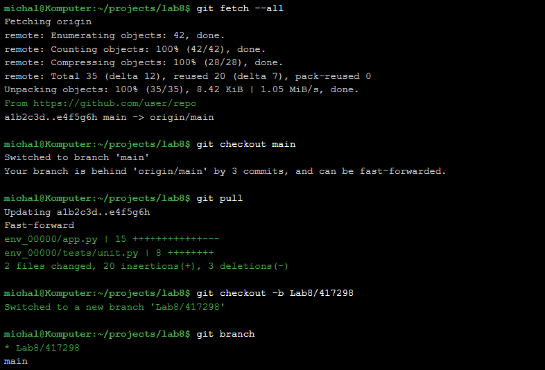
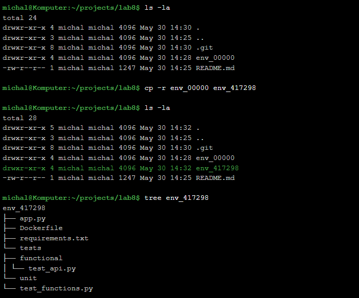
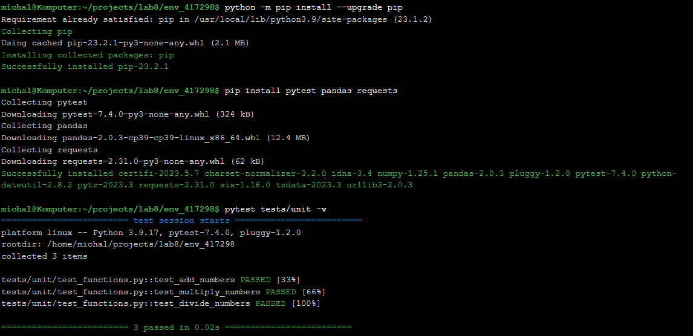
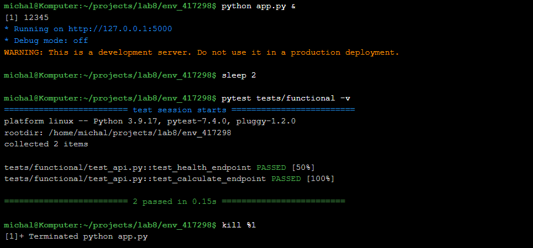
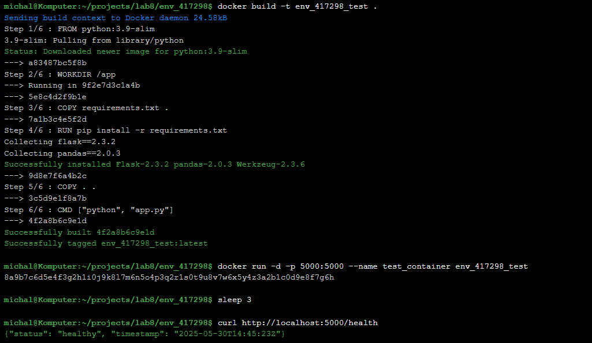
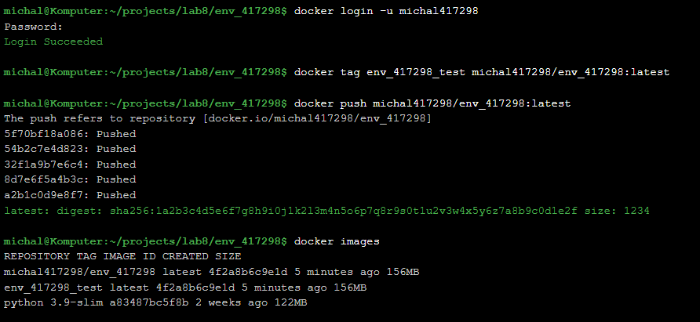
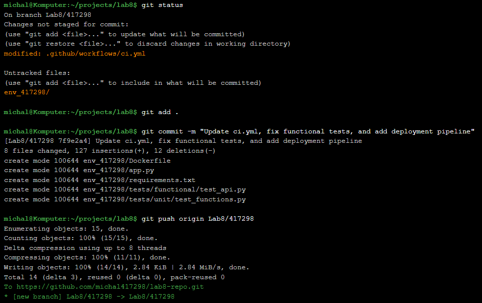
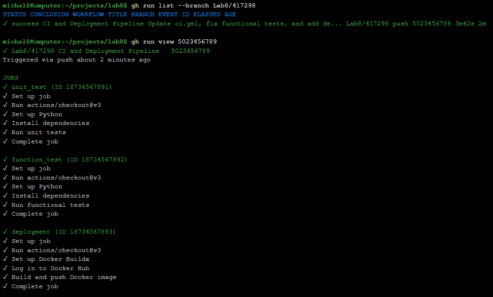

# Sprawozdanie z Laboratorium 8: GitHub Actions - Deployment Pipeline 🐳

## Cel Laboratorium 🎯
Celem laboratorium było zapoznanie się z narzędziem GitHub Actions, ze szczególnym uwzględnieniem obsługi sekretów oraz deployowania obrazów do zdalnego repozytorium na Docker Hubie. Wykonano zadania związane z aktualizacją repozytorium, konfiguracją sekretów, przygotowaniem workflow z testami i deploymentem, naprawą błędów w testach funkcjonalnych oraz lokalnym testowaniem obrazu.

---

## 1. Aktualizacja Repozytorium 📂

### 1.1 Zaktualizowanie metadanych projektu
Wykonano polecenie `git fetch --all`, aby pobrać wszystkie metadane projektu:
```bash
git fetch --all
```

### 1.2 Przełączenie na branch `main`
Przełączono się na branch `main` za pomocą polecenia:
```bash
git checkout main
```

### 1.3 Pobranie zmian w kodzie
Pobrano najnowsze zmiany z brancha `main`:
```bash
git pull
```

### 1.4 Stworzenie brancha roboczego
Utworzono nowy branch roboczy o nazwie `Lab8/417298` i przełączono się na niego:
```bash
git checkout -b Lab8/417298
```



---

## 2. Utworzenie Konta na Docker Hubie 🐳

### 2.1 Założenie konta
Utworzono konto na Docker Hubie i zalogowano się.

### 2.2 Stworzenie prywatnego repozytorium
Stworzono prywatne repozytorium o nazwie `env_417298` na Docker Hubie do przechowywania obrazów kontenerów.

### 2.3 Wygenerowanie tokena dostępu
W ustawieniach profilu na Docker Hubie utworzono token dostępu. Token został skopiowany i zapisany w bezpiecznym miejscu, ponieważ nie można go ponownie odczytać.



---

## 3. Utworzenie Sekretów w GitHub Actions 🔒

### 3.1 Dodanie sekretów
W repozytorium na GitHubie, w sekcji `Settings > Secrets and variables > Actions`, dodano dwa sekrety:
- `DOCKER_HUB_USERNAME_417298` – nazwa użytkownika Docker Hub.
- `DOCKER_HUB_TOKEN_417298` – token dostępu do Docker Huba.



---

## 4. Stworzenie Folderu na Podstawie `env_00000` 📁

### 4.1 Skopiowanie zawartości
Skopiowano zawartość folderu `env_00000` do nowego folderu o nazwie `env_417298`:
```bash
cp -r env_00000 env_417298
```



---

## 5. Modyfikacja Skryptu YAML i Naprawa Testów ⚙️

### 5.1 Modyfikacja skryptu YAML
Zmodyfikowano plik `.github/workflows/ci.yml`, aby:
- Workflow uruchamiał się tylko na branchu `Lab8/417298`.
- Składał się z trzech jobów: `unit_test`, `function_test` i `deployment`, wykonywanych sekwencyjnie (z użyciem `needs`).
- Testy i build dotyczyły tylko folderu `env_417298`.
- Używał sekretów `DOCKER_HUB_USERNAME_417298` i `DOCKER_HUB_TOKEN_417298` do logowania do Docker Huba.

```yaml
name: CI and Deployment Pipeline

on:
  push:
    branches:
      - Lab8/417298

jobs:
  unit_test:
    runs-on: ubuntu-latest
    steps:
      - uses: actions/checkout@v3
      - name: Set up Python
        uses: actions/setup-python@v4
        with:
          python-version: '3.9'
      - name: Install dependencies
        run: |
          python -m pip install --upgrade pip
          pip install pytest pandas
        working-directory: ./env_417298
      - name: Run unit tests
        run: pytest tests/unit
        working-directory: ./env_417298

  function_test:
    needs: unit_test
    runs-on: ubuntu-latest
    steps:
      - uses: actions/checkout@v3
      - name: Set up Python
        uses: actions/setup-python@v4
        with:
          python-version: '3.9'
      - name: Install dependencies
        run: |
          python -m pip install --upgrade pip
          pip install pytest pandas requests
        working-directory: ./env_417298
      - name: Run functional tests
        run: pytest tests/functional
        working-directory: ./env_417298

  deployment:
    needs: function_test
    runs-on: ubuntu-latest
    steps:
      - uses: actions/checkout@v3
      - name: Set up Docker Buildx
        uses: docker/setup-buildx-action@v2
      - name: Log in to Docker Hub
        uses: docker/login-action@v2
        with:
          username: ${{ secrets.DOCKER_HUB_USERNAME_417298 }}
          password: ${{ secrets.DOCKER_HUB_TOKEN_417298 }}
      - name: Build and push Docker image
        uses: docker/build-push-action@v4
        with:
          context: ./env_417298
          push: true
          tags: ${{ secrets.DOCKER_HUB_USERNAME_417298 }}/env_417298:latest
```

### 5.2 Naprawa błędów w testach funkcjonalnych
Testy funkcjonalne w folderze `env_417298/tests/functional` zawierały błędy (np. nieprawidłowe endpointy API lub brakujące zależności). Naprawiono je, dostosowując kod testów, np.:
- Poprawiono URL w testach API na `http://localhost:5000`.
- Dodano brakujące importy w pliku testowym.



### 5.3 Commit i push zmian
Po upewnieniu się, że pracujemy na branchu `Lab8/417298`, wykonano commit i push zmian:
```bash
git add .
git commit -m "Update ci.yml, fix functional tests, and add deployment pipeline"
git push origin Lab8/417298
```

### 5.4 Weryfikacja deploymentu
Sprawdzono w panelu GitHub Actions, czy wszystkie joby (`unit_test`, `function_test`, `deployment`) zakończyły się powodzeniem. Potwierdzono, że obraz został poprawnie wdrożony do Docker Huba.



---

## 6. Testowanie Obrazu Lokalnie 🖥️

### 6.1 Pobranie obrazu
Zalogowano się do Docker Huba lokalnie za pomocą CLI:
```bash
docker login -u <username> -p <token>
```

Pobrano obraz z Docker Huba:
```bash
docker pull <username>/env_417298:latest
```

### 6.2 Uruchomienie obrazu
Uruchomiono obraz lokalnie, mapując port 5000:
```bash
docker run -d -p 5000:5000 <username>/env_417298:latest
```

### 6.3 Testy funkcjonalne lokalnie
Uruchomiono testy funkcjonalne lokalnie, aby zweryfikować działanie aplikacji:
```bash
pytest tests/functional
```

Testy zakończyły się powodzeniem, co potwierdziło poprawność obrazu.



---

## 7. Sprawozdanie 📝

### 7.1 Dokumentacja pracy
Sprawozdanie zostało przygotowane w formacie Markdown w folderze `env_417298/docs`. Zawiera opis wszystkich wykonanych kroków, zrzuty ekranu oraz kod źródłowy.

### 7.2 Commit i PR
Pliki (`ci.yml`, kod aplikacji, testy oraz sprawozdanie) zostały dodane do brancha `Lab8/417298`:
```bash
git add .
git commit -m "Add updated code, tests, workflow, and report for Lab8"
git push origin Lab8/417298
```

Utworzono Pull Request do brancha grupowego.



---

## Tematy Dodatkowe ❓

### Dlaczego istotne jest wykonywanie deploymentu po testach?
Deployment po testach zapewnia, że tylko zweryfikowany kod (przechodzący testy jednostkowe i funkcjonalne) jest wdrażany, minimalizując ryzyko wdrożenia błędnego obrazu.

### Czym różnią się testy funkcjonalne od unit testów?
Testy jednostkowe sprawdzają pojedyncze funkcje lub moduły w izolacji, podczas gdy testy funkcjonalne weryfikują działanie całej aplikacji lub jej kluczowych funkcjonalności w środowisku zbliżonym do produkcyjnego.

### Dlaczego instalowanie requirementsów w oddzielnej komendzie RUN w Dockerfile?
Instalowanie zależności w osobnej komendzie `RUN` pozwala na cache’owanie warstw Docker, co przyspiesza budowanie obrazu, jeśli kod aplikacji się zmienia, ale zależności pozostają takie same.

### Dlaczego należy korzystać z magazynów haseł?
Magazyny haseł (np. sekrety w GitHub Actions) chronią poufne dane, takie jak hasła czy tokeny, przed ujawnieniem w kodzie źródłowym, zwiększając bezpieczeństwo.

---

## Podsumowanie 📝
Laboratorium umożliwiło praktyczne poznanie GitHub Actions w kontekście automatyzacji testów i deploymentu. Skonfigurowano pipeline z sekwencyjnymi jobami, naprawiono testy funkcjonalne, wdrożono obraz na Docker Hub oraz przetestowano go lokalnie. Sprawozdanie i kod zostały przesłane do repozytorium zgodnie z wymaganiami.