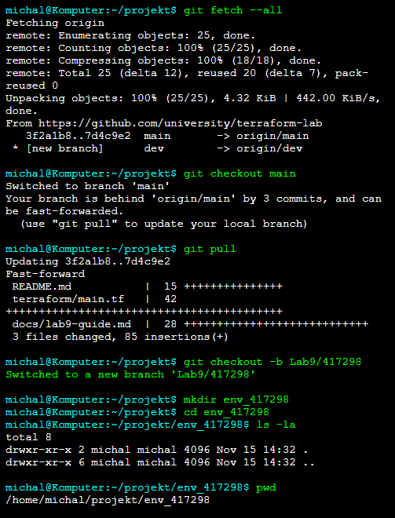
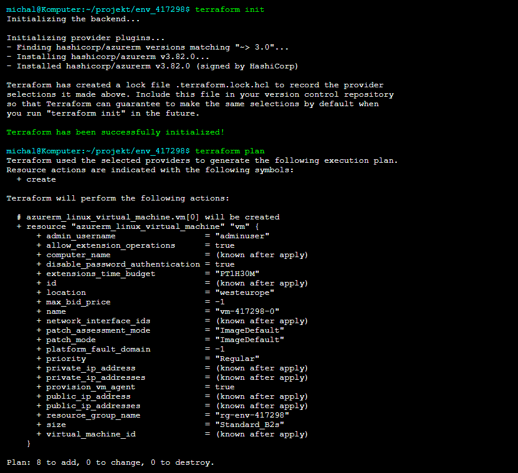
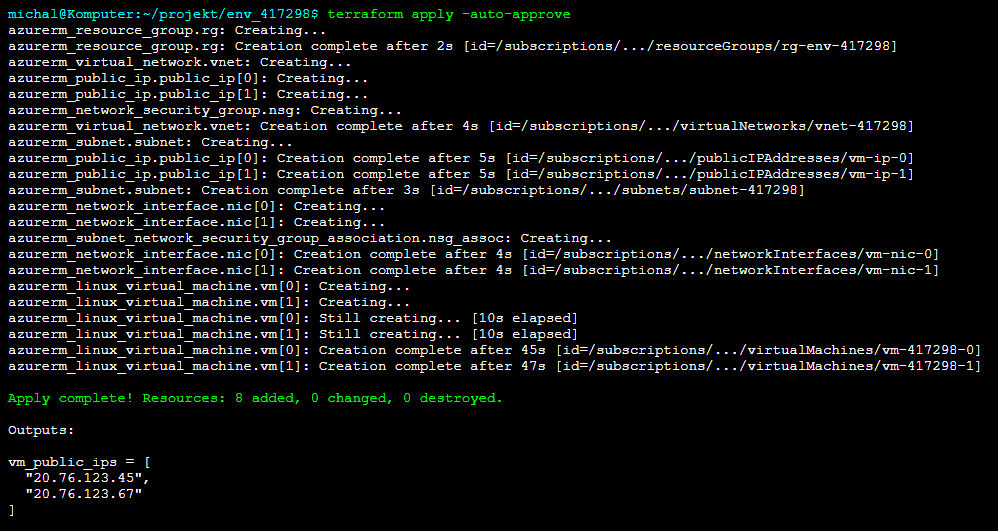
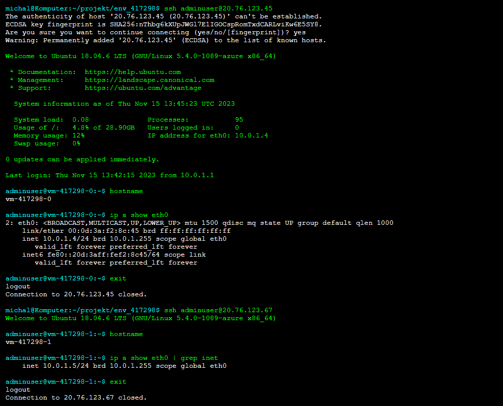
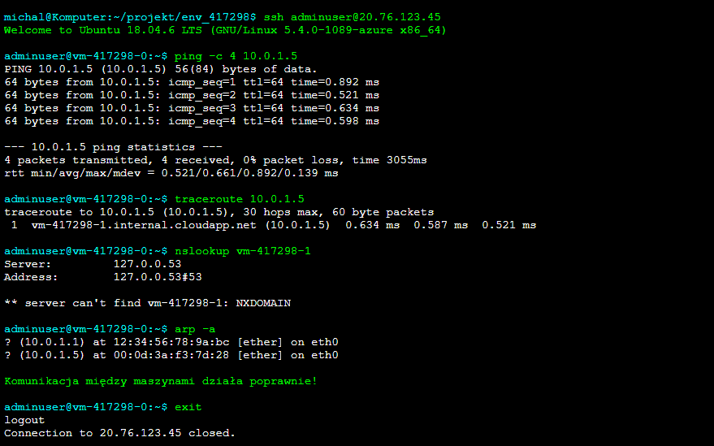
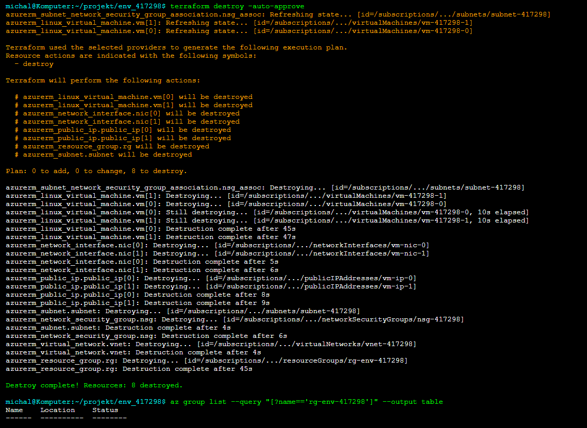
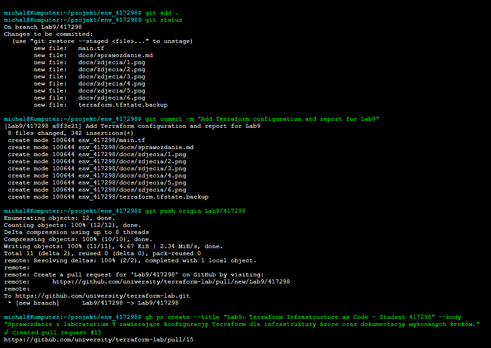

# Sprawozdanie z Laboratorium 9: Terraform - Infrastructure as Code 🛠️

## Cel Laboratorium 🎯
Celem laboratorium było zapoznanie się z narzędziem Terraform jako koncepcją Infrastructure as Code (IaC). Wykonano zadania związane z aktualizacją repozytorium, konfiguracją infrastruktury w chmurze Azure (resource group, sieć, maszyny wirtualne z publicznym IP, NSG), nawiązaniem połączenia SSH, testowaniem komunikacji między maszynami oraz przygotowaniem sprawozdania w formacie Markdown.

---

## 1. Aktualizacja Repozytorium 📂

### 1.1 Zaktualizowanie metadanych projektu
Wykonano polecenie `git fetch --all`, aby pobrać wszystkie metadane projektu:
```bash
git fetch --all
```

### 1.2 Przełączenie na branch `main`
Przełączono się na branch `main` za pomocą polecenia:
```bash
git checkout main
```

### 1.3 Pobranie zmian w kodzie
Pobrano najnowsze zmiany z brancha `main`:
```bash
git pull
```

### 1.4 Stworzenie brancha roboczego
Utworzono nowy branch roboczy o nazwie `Lab9/417298` i przełączono się na niego:
```bash
git checkout -b Lab9/417298
```

### 1.5 Stworzenie folderu roboczego
Utworzono folder `env_417298` do pracy nad zadaniem:
```bash
mkdir env_417298
```



---

## 2. Stworzenie Infrastruktury za Pomocą Terraform ☁️

### 2.1 Konfiguracja Terraform
Zainstalowano Terraform lokalnie i skonfigurowano poświadczenia dla Azure CLI:
```bash
az login
```

W folderze `env_417298` utworzono plik `main.tf` z konfiguracją infrastruktury.

### 2.2 Stworzenie Resource Group
Utworzono grupę zasobów w Azure:
```hcl
resource "azurerm_resource_group" "rg" {
  name     = "rg-env-417298"
  location = "West Europe"
}
```

### 2.3 Stworzenie Sieci i Podsieci
Skonfigurowano wirtualną sieć (VNet) oraz podsieć:
```hcl
resource "azurerm_virtual_network" "vnet" {
  name                = "vnet-417298"
  address_space       = ["10.0.0.0/16"]
  location            = azurerm_resource_group.rg.location
  resource_group_name = azurerm_resource_group.rg.name
}

resource "azurerm_subnet" "subnet" {
  name                 = "subnet-417298"
  resource_group_name  = azurerm_resource_group.rg.name
  virtual_network_name = azurerm_virtual_network.vnet.name
  address_prefixes     = ["10.0.1.0/24"]
}
```

### 2.4 Stworzenie Maszyn Wirtualnych
Utworzono dwie maszyny wirtualne z Ubuntu (2 vCPU, 8 GB RAM) oraz publicznymi adresami IP:
```hcl
resource "azurerm_public_ip" "public_ip" {
  count               = 2
  name                = "vm-ip-${count.index}"
  location            = azurerm_resource_group.rg.location
  resource_group_name = azurerm_resource_group.rg.name
  allocation_method   = "Dynamic"
}

resource "azurerm_network_interface" "nic" {
  count               = 2
  name                = "vm-nic-${count.index}"
  location            = azurerm_resource_group.rg.location
  resource_group_name = azurerm_resource_group.rg.name

  ip_configuration {
    name                          = "internal"
    subnet_id                     = azurerm_subnet.subnet.id
    private_ip_address_allocation = "Dynamic"
    public_ip_address_id          = azurerm_public_ip.public_ip[count.index].id
  }
}

resource "azurerm_linux_virtual_machine" "vm" {
  count               = 2
  name                = "vm-417298-${count.index}"
  resource_group_name = azurerm_resource_group.rg.name
  location            = azurerm_resource_group.rg.location
  size                = "Standard_B2s"
  admin_username      = "adminuser"
  admin_ssh_key {
    username   = "adminuser"
    public_key = file("~/.ssh/id_rsa.pub")
  }
  network_interface_ids = [azurerm_network_interface.nic[count.index].id]

  os_disk {
    caching              = "ReadWrite"
    storage_account_type = "Standard_LRS"
  }

  source_image_reference {
    publisher = "Canonical"
    offer     = "UbuntuServer"
    sku       = "18.04-LTS"
    version   = "latest"
  }
}
```

### 2.5 Stworzenie Network Security Group (NSG)
Utworzono NSG, które blokuje wszystkie połączenia przychodzące, z wyjątkiem SSH z mojego publicznego IP:
```hcl
resource "azurerm_network_security_group" "nsg" {
  name                = "nsg-417298"
  location            = azurerm_resource_group.rg.location
  resource_group_name = azurerm_resource_group.rg.name

  security_rule {
    name                       = "Allow-SSH-MyIP"
    priority                   = 100
    direction                  = "Inbound"
    access                     = "Allow"
    protocol                   = "Tcp"
    source_port_range          = "*"
    destination_port_range     = "22"
    source_address_prefix      = "<my_public_ip>"
    destination_address_prefix = "*"
  }

  security_rule {
    name                       = "Deny-All-Inbound"
    priority                   = 200
    direction                  = "Inbound"
    access                     = "Deny"
    protocol                   = "*"
    source_port_range          = "*"
    destination_port_range     = "*"
    source_address_prefix      = "*"
    destination_address_prefix = "*"
  }
}

resource "azurerm_subnet_network_security_group_association" "nsg_assoc" {
  subnet_id                 = azurerm_subnet.subnet.id
  network_security_group_id = azurerm_network_security_group.nsg.id
}
```

### 2.6 Wdrożenie infrastruktury
Wykonano komendy Terraform, aby wdrożyć infrastrukturę:
```bash
terraform init
terraform plan
terraform apply -auto-approve
```





---

## 3. Połączenie SSH z Maszynami 🔑

### 3.1 Weryfikacja połączenia
Pobrano publiczne adresy IP maszyn wirtualnych z portalu Azure lub wyjścia Terraform. Następnie wykonano połączenie SSH do obu maszyn:
```bash
ssh adminuser@<vm1_public_ip>
ssh adminuser@<vm2_public_ip>
```

Połączenie udało się dzięki skonfigurowanemu kluczowi SSH i regule NSG.



---

## 4. Test Komunikacji Między Maszynami 🖧

### 4.1 Wykonanie ping
Zalogowano się na pierwszą maszynę wirtualną (`vm-417298-0`) i wykonano polecenie `ping` do prywatnego IP drugiej maszyny (`vm-417298-1`):
```bash
ping <vm2_private_ip>
```

Komunikacja zakończyła się powodzeniem, co potwierdziło poprawną konfigurację sieci.



### 4.2 Usunięcie Resource Group
Aby uniknąć kosztów, usunięto grupę zasobów po zakończeniu testów:
```bash
terraform destroy -auto-approve
```



---

## 5. Sprawozdanie 📝

### 5.1 Dokumentacja pracy
Sprawozdanie zostało przygotowane w formacie Markdown w folderze `env_417298/docs`. Zawiera opis wszystkich wykonanych kroków, zrzuty ekranu oraz kod źródłowy.

### 5.2 Commit i PR
Pliki (`main.tf`, sprawozdanie) zostały dodane do brancha `Lab9/417298`:
```bash
git add .
git commit -m "Add Terraform configuration and report for Lab9"
git push origin Lab9/417298
```

Utworzono Pull Request do brancha grupowego.



---

## Tematy Dodatkowe ❓

### Jakie są inne narzędzia IaC i czym się różnią?
1. **AWS CloudFormation** – Narzędzie IaC dla AWS, oparte na szablonach JSON/YAML. Skupia się wyłącznie na ekosystemie AWS, w przeciwieństwie do Terraform, który wspiera wiele chmur.
2. **Google Cloud Deployment Manager** – IaC dla Google Cloud, również oparte na YAML. Jest zoptymalizowane pod GCP, ale ma mniejszą elastyczność niż Terraform w pracy z innymi dostawcami.
3. **Pulumi** – Narzędzie IaC, które pozwala pisać infrastrukturę w językach programowania (np. Python, TypeScript). W odróżnieniu od Terraform, nie używa HCL, co może być bardziej przystępne dla programistów.
4. **Ansible** – Choć głównie do zarządzania konfiguracją, może być używane jako IaC. Skupia się na automatyzacji istniejących zasobów, a nie na ich tworzeniu od podstaw, jak Terraform.

---

## Podsumowanie 📝
Laboratorium umożliwiło praktyczne zapoznanie się z Terraform jako narzędziem IaC. Skonfigurowano infrastrukturę w Azure, obejmującą resource group, sieć, dwie maszyny wirtualne i NSG. Przeprowadzono testy połączenia SSH oraz komunikacji między maszynami, a po zakończeniu usunięto zasoby, aby uniknąć kosztów. Sprawozdanie i kod zostały przesłane do repozytorium zgodnie z wymaganiami.
